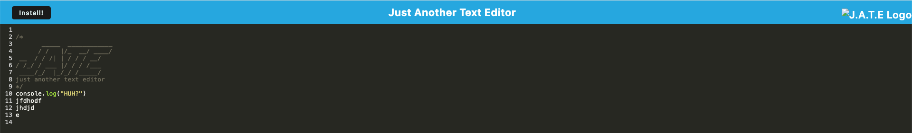

# social-media-api
[](https://opensource.org/licenses/MIT)
https://github.com/rickybehrens/pwa-text-editor


## Project Description
Build a text editor that runs in the browser. The app will be a single-page application that meets the PWA criteria. Additionally, it will feature a number of data persistence techniques that serve as redundancy in case one of the options is not supported by the browser. The application will also function offline.

## Table of Contents
- [Installation](#installation)
- [Usage](#usage)
- [License](#license)
- [Contributing](#contributing)
- [Tests](#tests)
- [Questions](#questions)
- [Screenshots](#screenshots)
  
## Installation
To install necessary dependencies, run the following command:
```
npm i
```

  
## Usage
This app is a simple text editor that meets the PWA criteria and the user is able to download it to tany computer and use it offline. Its usages is very simple, the user just needs to tye in and the edito will work just any other text editor.

  
## License
This project is licensed under the MIT license.


Copyright (c) 2023 Ricardo Behrens. All rights reserved.


Permission is hereby granted, free of charge, to any person obtaining a copy of this software and associated documentation files (the "Software"), to deal in the Software without restriction, including without limitation the rights to use, copy, modify, merge, publish, distribute, sublicense, and/or sell copies of the Software, and to permit persons to whom the Software is furnished to do so, subject to the following conditions:

The above copyright notice and this permission notice shall be included in all copies or substantial portions of the Software.

THE SOFTWARE IS PROVIDED "AS IS", WITHOUT WARRANTY OF ANY KIND, EXPRESS OR IMPLIED, INCLUDING BUT NOT LIMITED TO THE WARRANTIES OF MERCHANTABILITY, FITNESS FOR A PARTICULAR PURPOSE AND NONINFRINGEMENT. IN NO EVENT SHALL THE AUTHORS OR COPYRIGHT HOLDERS BE LIABLE FOR ANY CLAIM, DAMAGES OR OTHER LIABILITY, WHETHER IN AN ACTION OF CONTRACT, TORT OR OTHERWISE, ARISING FROM, OUT OF OR IN CONNECTION WITH THE SOFTWARE OR THE USE OR OTHER DEALINGS IN THE SOFTWARE.
  
    
## Contributing
If you would like to contribute to this app, please refer to the questions section.

  
## Tests
To run tests, run the following command:
```
npm test
```

  
## Questions
If you have any questions about the repo, open an issue or contact me directly at [behrensricardo@gmail.com](mailto:behrensricardo@gmail.com). You can find more of my work at [rickybehrens](https://github.com/rickybehrens).

## Screenshots
<!-- Add screenshots here -->


